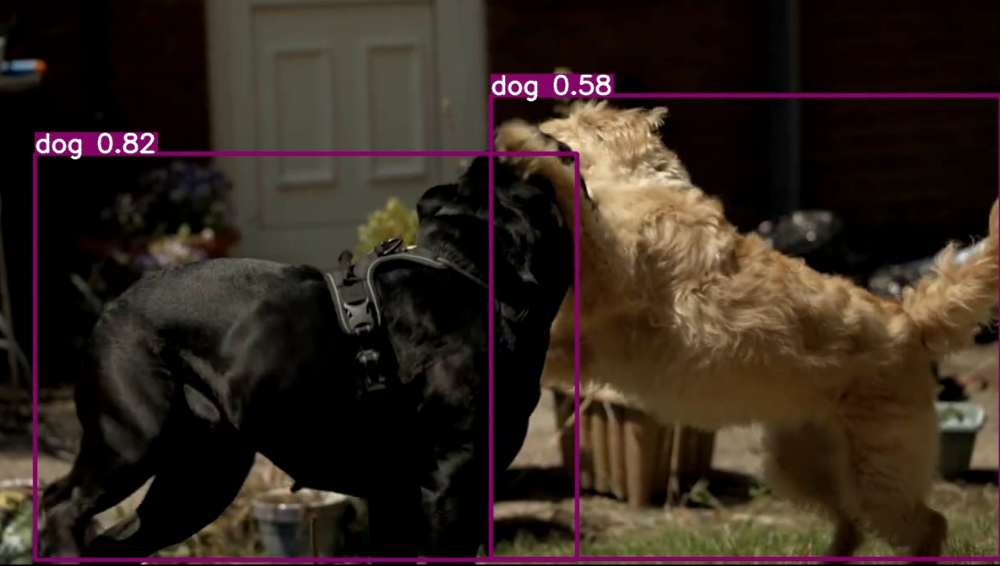
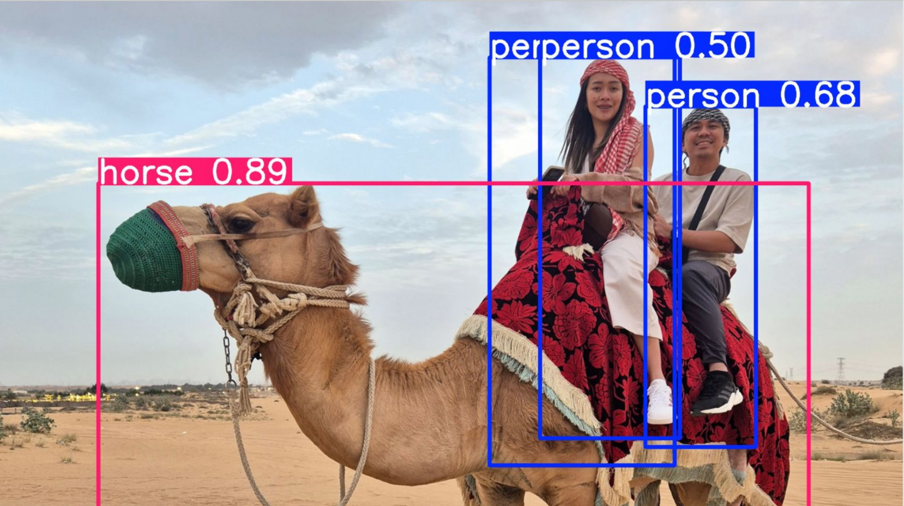
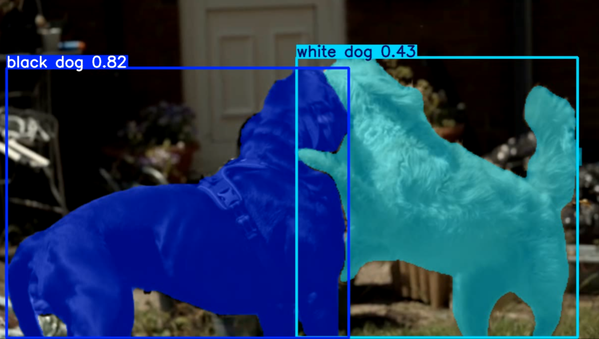
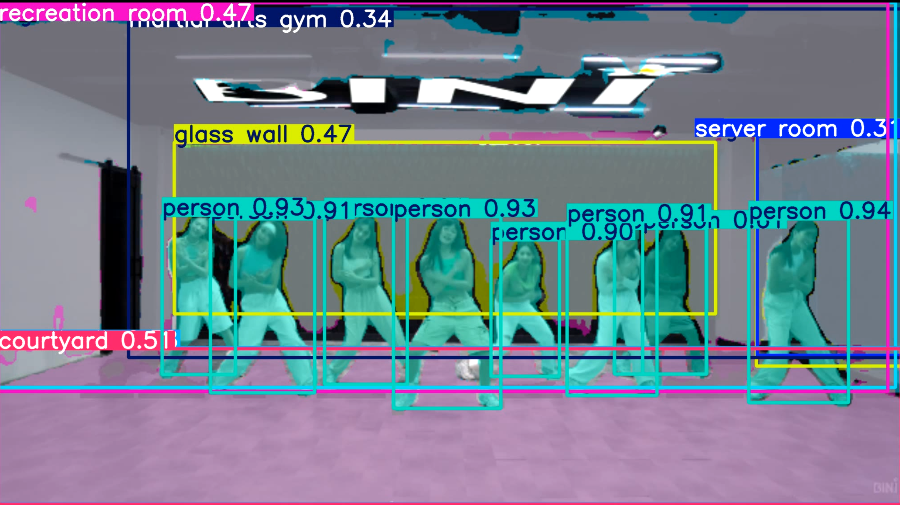

# 🦾 YOLOE: Real-Time Open-Vocabulary Object Detection

You might already be familiar with **YOLO** — the fast and efficient model that can find and label objects in images in real time. Maybe you've even heard of **CLIP**, which helps machines "understand" images using natural language.

But here’s the catch: traditional object detectors like YOLO are trained to recognize a **fixed set of objects**. That works fine in controlled setups, but the real world? It’s full of surprises.

That’s where **open-vocabulary object detection** steps in — and it’s a game-changer. Instead of being limited to a fixed list of labels, open-vocabulary models can detect *anything* — even things they've never seen before — just by using text or image prompts.

---

## 🔎 A Quick Refresher: What’s Object Detection?

Object detection = classification + localization.  
It’s about not just knowing *what’s* in an image, but also *where* it is.

> 🖼️ Example: spotting a dog in a photo and drawing a box around it.
> 

---

## 🧱 Traditional YOLO: Fast but Limited

YOLO (You Only Look Once) became super popular for being fast and lightweight. It processes an image in one go and detects objects at blazing speed.

However, YOLO operates under a **closed-world assumption**, which means:

- It can **only detect objects** it was trained on.
- Typically uses the **COCO dataset** with 80 classes:
0: person 1: bicycle 2: car ... 17: horse ... 77: teddy bear 78: hair drier 79: toothbrush

### 🚫 Real-world Problem: Misclassification

If you feed it an image of a **camel**, YOLO might label it as a **horse**, simply because "camel" isn't in the COCO dataset.

---

## 🚀 Enter Open-Vocabulary Detection

Open-vocabulary detection allows object detectors to respond to *any* text prompt — even labels they’ve never seen during training.

This is enabled by **CLIP**-style models, which align images and text in a shared embedding space.

---

## 🤝 YOLO-World: YOLO + CLIP

**YOLO-World** combines YOLO's speed with CLIP’s text/image understanding.

- Instead of fixed class labels, you can use **natural language prompts**.
- It uses an image encoder + text encoder to compare visual features to *any* label you provide.
---

## 🧠 YOLOE: The Next Level

**YOLOE** (YOLO-Everything) is the latest and most powerful version.  
It extends YOLO-World with three cutting-edge modules:

### 🧩 Key Components

- **Re-parameterizable Region-Text Alignment (RepRTA)**  
Efficient matching of image regions and text prompts *without slowing down inference*.

- **Semantic-Activated Visual Prompt Encoder (SAVPE)**  
Show the model an image example and ask it to "find more things like this."  
(Like one-shot learning — but built-in!)

- **Lazy Region-Prompt Contrast (LRPC)**  
When no prompt is given, the model *autonomously guesses* object classes using large vocabularies (e.g. LVIS, Objects365).

### 🧪 Use Cases

- **Text Prompts**:  
prompts = ["white dog", "black dog"]
> 

### 🧠 No Prompts (LRPC Mode)
YOLOE will use internal embeddings to detect from 4,000+ learned categories.
> 

---

## ✅ Conclusion

Object detection has evolved:

- **From YOLO**: Fast but closed  
- **To YOLO-World**: Text-promptable  
- **Now to YOLOE**: Truly open-vocabulary

In the real world, where object variety is infinite, **YOLOE’s ability to detect rare or unseen items using just a word or image is a huge leap forward**.

As we move toward general and adaptable AI systems, **open-vocabulary detection is the future**.

---

## 👤 About Me

I'm **Nikko**, a Machine Learning Engineer and AI enthusiast with a Master's degree in Artificial Intelligence from the University of the Philippines Diliman. With over a decade of experience in ICT consulting and telecommunications, I now specialize in **vision-language models**, **LLMs**, and **generative AI applications**.

I'm passionate about creating systems where AI and humans can collaborate seamlessly — working toward a future where **smart cities** and intelligent automation become reality.    

Feel free to connect with me on [LinkedIn](https://www.linkedin.com/in/nikkoyabut/).

